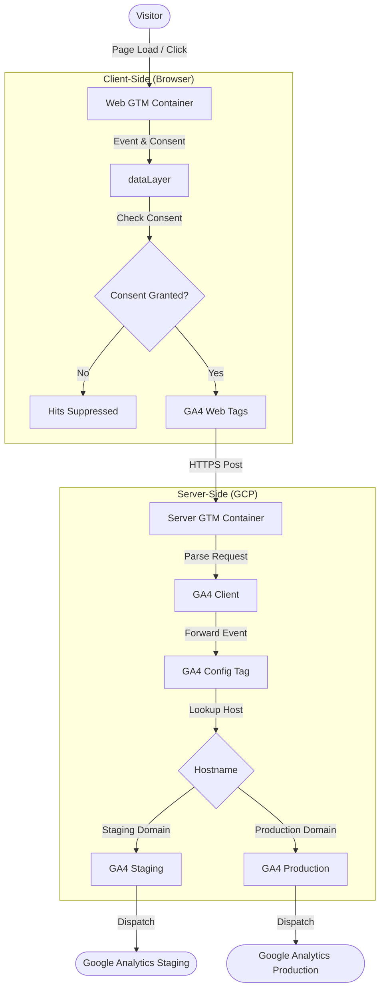

# Google Tag Manager (GTM) Architecture Overview

This directory contains the documentation for the Google Tag Manager setup for **simonask.io**. 

Our tracking system uses a hybrid model combining a traditional **Client-Side Web Container** with a **Server-Side Container**. This setup optimizes site performance, increases data privacy, and enables first-party cookie management.

---

## Tracking Architecture

The following diagram illustrates how user interactions on the website are tracked, evaluated for consent, routed through our server-side container, and dispatched to Google Analytics.

---

## Containers

The setup is split across two GTM containers. Please refer to their individual folders and documentation files for detailed configurations, including tags, triggers, and variables:

### 1. [Client-Side Web Container](file:///c:/Users/Simon/.gemini/antigravity-ide/scratch/Google%20Tag%20Manager%20MCP/docs/GTM/simonask.io%20(web)/README.md)
* **Container ID:** `253101870`
* **Public ID:** `GTM-KR894J8P`
* **Role:** Captures browser interactions (page views, button clicks, form submissions, and scroll depth), checks cookie consent settings via the `dataLayer`, and packages these events to route to our server container.

### 2. [Server-Side Container](file:///c:/Users/Simon/.gemini/antigravity-ide/scratch/Google%20Tag%20Manager%20MCP/docs/GTM/simonask.io%20(server)/README.md)
* **Container ID:** `253113551`
* **Public ID:** `GTM-PS3KHKB6`
* **Role:** Intercepts traffic at `https://serverside.simonask.io`, sets first-party client identifiers (`FPID` cookies), dynamically decides whether the traffic is testing (local/staging) or production, maps it to the correct Google Analytics Measurement ID, and forwards it to Google's servers.

---

## Key Tracking Guidelines & Practices

* **Consent is Mandatory:** No tracking tags are fired on the client side unless the visitor grants analytics consent. Every custom event trigger explicitly gates itself with a `{{DLV - analytics_consent}}` filter.
* **First-Party Routing:** Do not route client-side tags directly to `google-analytics.com`. Always route tags through the server URL: `https://serverside.simonask.io` to ensure analytics requests originate from our own subdomain.
* **Environment Separation:** Hostname routing is handled dynamically in the Server container. There is no need to create separate tags or containers for stage and production websites. The server container reads the request origin and handles routing automatically.
