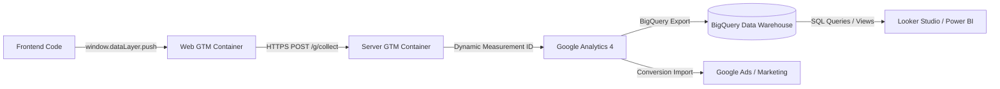
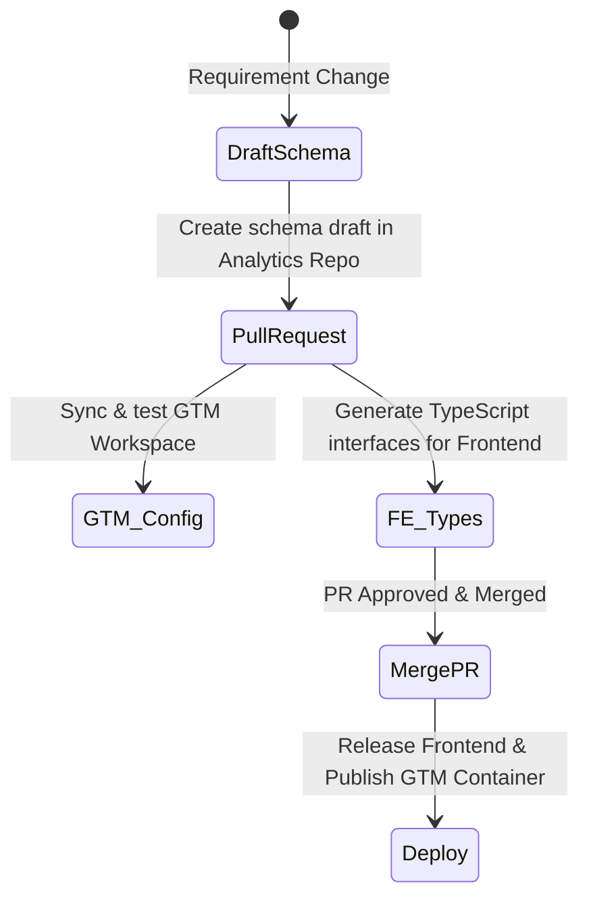

# Analytics Dependency Management & Downstream Breakage Prevention

In a modern analytics setup, any change to your website's front-end code can trigger a silent chain reaction that breaks downstream dashboards, marketing attribution, and data warehouse queries. 

This document outlines the **Data Contract** approach used to track, audit, and prevent downstream breakage across **simonask.io**'s analytics pipeline.

---

## 1. The Tracking Pipeline & Dependency Chain

The tracking pipeline functions as a single continuous dependency chain. A failure at the front-end level invalidates all downstream data processing:



### Breakdown of Downstream Dependencies

| Component | Depends On | Common Failure Mode | Impact |
| :--- | :--- | :--- | :--- |
| **Web GTM** | `dataLayer` structure | Field name change (e.g., `button_location` $\rightarrow$ `btn_loc`) | GTM variables resolve to `undefined`; triggers fail to fire or tags send empty fields. |
| **Server GTM** | Web GTM request body | Hostname parameter name (`page_hostname`) | Server container fails to route events dynamically, routing production hits to staging property. |
| **Google Analytics 4** | Web GTM tag setup | Custom definitions, event parameters | Missing parameters in reports, broken engagement metrics, lost custom dimension data. |
| **Google Ads** | GA4 Event Conversions | GA4 event names (`contact_form_submit`) | Conversion tracking stops, bidding algorithms lose signal, ad campaign performance drops. |
| **BigQuery** | GA4 schema structure | Event/parameter names in JSON payload | Nested SQL queries fail (`event_params.value.string_value` is null), breaking daily data runs. |
| **Looker Studio / Power BI**| BigQuery views or GA4 API | Table schemas, dimension names | Broken dashboard charts, error widgets, invalid KPIs presented to stakeholders. |

---

## 2. The Core Solution: Schema-Driven Data Contracts

To prevent these issues, we establish a **Data Contract** as the single source of truth. Data contracts are represented by **JSON Schemas** stored in the [contracts/dataLayer/](file:///c:/Users/Simon/.gemini/antigravity-ide/scratch/Analytics/contracts/dataLayer) folder.

### The Contract-First Workflow


---

## 3. Implementation: Preventing Breakage at Each Stage

### A. Frontend Application (Shift-Left Validation)

Frontend developers should have compile-time checks and test gates so that they cannot merge code changes that violate the tracking schema.

#### 1. Compile-Time Type Safety (TypeScript)
Auto-generate TypeScript types from JSON Schemas. If a developer attempts to push an invalid payload structure, their IDE will flag it, and the build will fail.

```bash
# Generate types automatically in the frontend codebase
npx json-schema-to-typescript contracts/dataLayer/contact_click.json > types/tracking.d.ts
```

This generates type-safe contracts in the frontend:
```typescript
export interface ContactClickEvent {
  event: "contact_click";
  button_location: "header" | "hero" | "footer" | "body";
}

// Frontend tracking utility
export function trackContactClick(payload: ContactClickEvent) {
  window.dataLayer = window.dataLayer || [];
  window.dataLayer.push(payload);
}
```

#### 2. E2E Test Gates (Cypress / Playwright Validation)
Validate `window.dataLayer` pushes against JSON schemas during end-to-end testing before any code is deployed to staging or production.

```javascript
import Ajv from 'ajv';
import contactClickSchema from '../contracts/dataLayer/contact_click.json';

const ajv = new Ajv();
const validate = ajv.compile(contactClickSchema);

// In a Playwright/Cypress test:
const dataLayerHistory = await page.evaluate(() => window.dataLayer);
const clickEvent = dataLayerHistory.find(e => e.event === 'contact_click');

const isValid = validate(clickEvent);
if (!isValid) {
  console.error("Schema errors:", validate.errors);
  throw new Error("dataLayer event does not comply with the contract!");
}
```

---

### B. Google Tag Manager (Workspace Mapping & Verification)

GTM has its own internal dependency map (Variables $\rightarrow$ Triggers $\rightarrow$ Tags). 

To ensure GTM stays aligned with our data contracts, we should audit our GTM containers regularly using one of the following methods:

#### 1. Using GTM Export Files for Validation
Save container JSON exports alongside the contracts and write a script to check that:
- Every event name defined in the schemas is mapped to a GTM Custom Event Trigger.
- Every property defined in the schema has a corresponding GTM Data Layer Variable.

#### 2. Utilizing the GTM MCP Server (Auditing Script Example)
If using the custom `gtm-mcp-server`, we can programmatically query GTM workspace elements. Here is a blueprint for an auditing script that checks configuration completeness:

```javascript
// GTM Audit Blueprint (NodeJS)
const gtm = require('gtm-api'); // or MCP tool wrapper
const fs = require('fs');

async function auditGtmContainer() {
  const workspaceId = '8'; // simonask.io (web) Workspace ID
  const variables = await gtm.listVariables(workspaceId);
  const triggers = await gtm.listTriggers(workspaceId);

  // Read our local data schemas
  const schemas = fs.readdirSync('./contracts/dataLayer').map(file => 
    JSON.parse(fs.readFileSync(`./contracts/dataLayer/${file}`, 'utf-8'))
  );

  console.log("🔍 Starting GTM Contract Verification...");

  schemas.forEach(schema => {
    const expectedEvent = schema.properties.event.const;
    
    // 1. Verify Trigger exists
    const hasTrigger = triggers.some(t => t.customEventFilter?.some(f => f.value === expectedEvent));
    if (!hasTrigger) {
      console.warn(`⚠️ Warning: No GTM custom event trigger found for schema event: "${expectedEvent}"`);
    }

    // 2. Verify Variables exist for properties
    const properties = Object.keys(schema.properties).filter(p => p !== 'event');
    properties.forEach(prop => {
      const hasVariable = variables.some(v => v.type === 'v' && v.parameter.some(p => p.key === 'name' && p.value === prop));
      if (!hasVariable) {
        console.warn(`⚠️ Warning: No GTM Data Layer Variable found for contract parameter: "${prop}"`);
      }
    });
  });
}
```

---

### C. Downstream Systems (GA4 & BigQuery)

#### 1. GA4 Custom Dimension Registration
If you send parameters like `button_location` or `form_location` in your GA4 events, you **must** register them as Custom Dimensions in the GA4 UI. Failing to do this means the parameters are collected but will not be accessible in standard reports or APIs.

- **Checklist:** Every time a new parameter is added to a schema in `contracts/dataLayer/`, create a corresponding **Event-Scoped Custom Dimension** in the GA4 admin interface using the exact parameter key.

#### 2. BigQuery SQL View Safety (Prevent SQL Breaks)
If you run analytical SQL queries on the BigQuery export, direct references to `event_params.value.string_value` can return `null` or break if schemas change. 

**Best Practice:** Encapsulate nested parameters in safe SQL views rather than querying the raw table directly. Use `COALESCE` or schema versioning in your queries:

```sql
-- Safe, versioned view for contact clicks
CREATE OR REPLACE VIEW `analytics_project.reporting.v_contact_clicks` AS
SELECT
  event_date,
  event_timestamp,
  user_pseudo_id,
  -- Safe extraction: handle potential schema variations
  (SELECT value.string_value FROM UNNEST(event_params) WHERE key = 'button_location') AS button_location,
  -- Fallback logic for legacy schema versions if button_location was named differently
  COALESCE(
    (SELECT value.string_value FROM UNNEST(event_params) WHERE key = 'button_location'),
    (SELECT value.string_value FROM UNNEST(event_params) WHERE key = 'legacy_button_loc')
  ) AS button_location_unified
FROM
  `analytics_project.analytics_9Z7Z8G75Q2.events_*`
WHERE
  event_name = 'contact_click';
```

---

## 4. Change Management SOP (Step-by-Step)

When modifying or adding tracking events, follow this exact checklist:

1. **Schema Update**: Update/create the schema JSON file in `contracts/dataLayer/`.
2. **GTM Preview**: Create a new workspace in Google Tag Manager (e.g. `Dev - Add X Property`). 
   - Add/update Variables, Triggers, and Tags.
   - Run GTM Preview mode to test the changes locally.
3. **Frontend Integration**: Generate updated TypeScript interfaces and implement the tracking code on the frontend.
4. **CI Validation**: Run E2E tests validating the front-end pushes against the schema.
5. **GA4 Audit**: Register any new parameters as Custom Dimensions in GA4.
6. **Publish GTM Workspace**: Publish the GTM container workspace version.
7. **Deploy Frontend Code**: Deploy the frontend changes to production.
8. **Downstream SQL Update**: If necessary, update BigQuery views or Looker Studio fields to include the new parameters.
